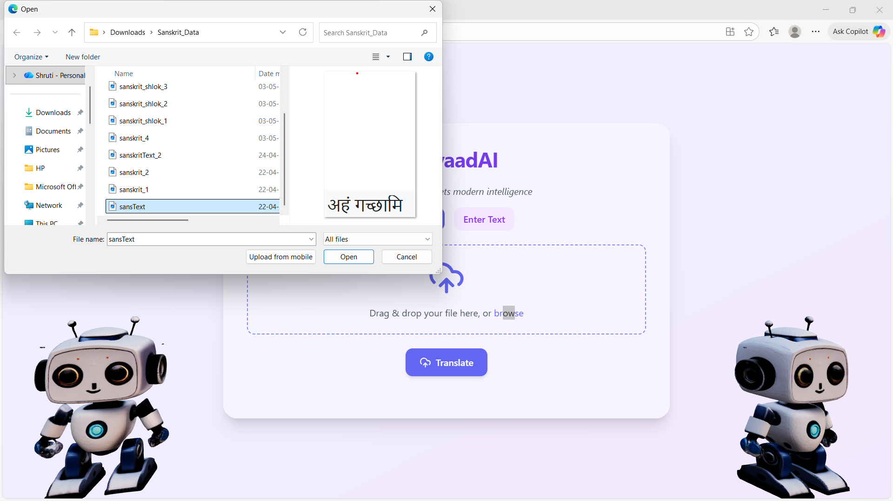

# 🌿 AnuvaadAI – English to Sanskrit Translator  

**Ancient wisdom meets modern intelligence.**  
AnuvaadAI is a web-based application that translates **Sanskrit text to English** using advanced Natural Language Processing (NLP) models. It provides both **text input** and **file upload** functionalities, enabling users to seamlessly translate Sanskrit scripts and shlokas with clarity and accuracy.

---

## 🧠 **Project Background**

Sanskrit, one of the oldest and most complex languages in the world, holds immense cultural and linguistic importance. However, its usage has declined due to the lack of accessible translation tools.  
**AnuvaadAI** bridges this gap by leveraging **AI-driven translation models** to make Sanskrit understanding and translation simpler for researchers, students and enthusiasts.

This project combines **OCR (Optical Character Recognition)** and **Machine Translation** techniques to detect, extract and translate Sanskrit text into English.

---

## 📜 **Project Description**

AnuvaadAI consists of two major components:  

1. **Frontend (React + Tailwind CSS)**  
   - A modern and intuitive UI for uploading files or entering text.  
   - Displays the translated text dynamically with clean typography and visuals.  
   - Includes a beautiful responsive layout and animated robot mascots for user engagement.

2. **Backend (Flask / Node.js + Python NLP Models)**  
   - Processes text and images sent from the frontend.  
   - Uses **Tesseract OCR** for text recognition (for Sanskrit images).  
   - Utilizes a **custom-trained MarianMT transformer model** for Sanskrit -> English translation.  
   - Integrates with APIs to provide high-quality translation outputs.

---

## ⚙️ **Tech Stack**

### 🔹 Frontend:
- React.js  
- Tailwind CSS  
- Axios  
- JavaScript (ES6)  

### 🔹 Backend:
- Python (Flask)  
- Tesseract OCR  
- MarianMT (Hugging Face Transformers)  
- PyTorch  

### 🔹 Other Tools:
- Node.js  
- Git & GitHub  

---

## 🚀 **How to Run the Project**

### 1. Clone the repository  
```bash
git clone https://github.com/shruti0731/MiniProject2.git
cd MiniProject2
cd MP-2-main
```

---

### 2. Setup the Backend  
```bash
pip install -r requirements.txt
python main.py
```
The backend server will start at:  
`http://localhost:5000`

---

### 3. Setup the Frontend  
```bash
cd frontend
npm install
npm start
```
The frontend will start at:  
`http://localhost:3000`

---

### 4. Usage  
- Enter Sanskrit text in the input box or upload an image containing Sanskrit text.  
- Click **Translate**.  
- The translated text will appear below, showing both **Sanskrit Text** and **English Translation**.  

---

## 🧾 **Results**  

  

  


  

Below is a sample translation result from the app:  

| Input (Sanskrit) | Output (English) |
|------------------|------------------|
| रामः जलं पिबति | Ram drinks water. |

  

---

## 💡 **Key Features**
✅ Text and image input support  
✅ Real-time translation feedback  
✅ Modern, minimal and responsive UI  
✅ AI-powered translation using MarianMT  
✅ Error handling and smooth UX  

---

## 🏁 **Future Enhancements**
- Support for speech input and audio translation  
- Integration with a multilingual translation model  
- Improved accuracy using fine-tuned Sanskrit datasets  
- Option to download translated results as PDF  

---

## 👩‍💻 **Contributors**
- **Shruti Chavan**
- **Srushti Jamdade**

---
